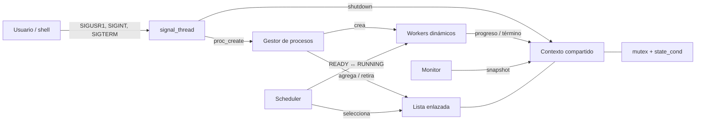
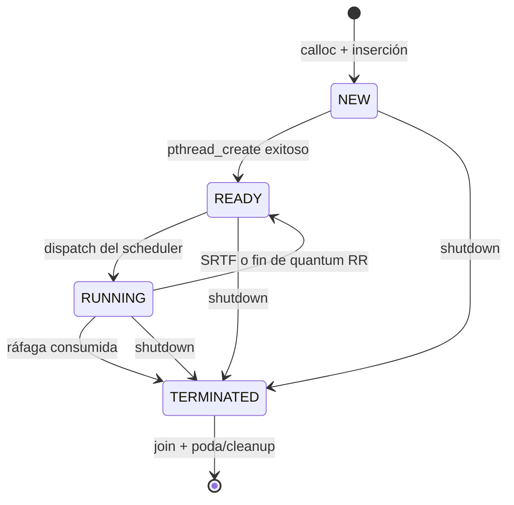

# Documentación técnica integral de OS Simulator

> Documento generado a partir de la lectura del código fuente completo del
> repositorio. Describe el estado del proyecto al 31 de agosto de 2026.

## 1. Resumen ejecutivo

OS Simulator es un simulador académico de planificación de CPU escrito en C11
para un entorno POSIX. Cada proceso simulado se representa mediante un
`pthread`; no se crea un proceso real del sistema operativo con `fork()`.

El programa permite crear procesos dinámicamente con `SIGUSR1`, planificarlos
con FCFS, SJF, SRTF o Round Robin, observarlos mediante una interfaz `ncurses` y
finalizar toda la simulación ordenadamente con `SIGINT` o `SIGTERM`.

La idea arquitectónica central es la **preempción cooperativa**: el scheduler no
suspende hilos por la fuerza. Cambia el estado lógico del proceso y cada worker
comprueba, en unidades de 10 ms, si todavía tiene autorización para consumir
CPU simulada. Esta decisión evita `pthread_cancel()`, `SIGSTOP`, espera activa y
operaciones no portables de suspensión de hilos.

Propiedades principales:

- lenguaje y plataforma: C11, pthreads, señales POSIX y ncurses;
- algoritmos: FCFS/FIFO, SJF, SRTF y Round Robin;
- concurrencia: un hilo de señales, un scheduler, un monitor y entre 0 y 20
  workers activos;
- sincronización: un mutex global, una condición global y una condición por
  proceso;
- estructura dinámica: lista simplemente enlazada de procesos;
- cierre seguro: despertar, salida y `pthread_join()` de todos los hilos antes
  de liberar memoria;
- observabilidad: hasta 10 eventos recientes y 10 procesos terminados en el
  historial visual.

## 2. Alcance funcional y requisitos satisfechos

La especificación resumida en `PROJECT_SPEC.md` solicita workers dinámicos,
cuatro estados, cuatro políticas de planificación, creación por señal, cierre
por señal, variables de condición, lista enlazada, mutex y liberación ordenada.
La implementación cubre esos puntos del siguiente modo:

| Requisito | Implementación |
|---|---|
| Procesos simulados dinámicos | Un `process_t` asignado con `calloc()` y un `pthread` por proceso |
| Máximo de activos | `OS_MAX_ACTIVE_PROCESSES = 20` |
| Estados | `NEW`, `READY`, `RUNNING`, `TERMINATED` |
| Creación | `SIGUSR1` recibido síncronamente mediante `sigwait()` |
| Apagado | `SIGINT` o `SIGTERM`, bandera global y broadcast de condiciones |
| FCFS | Menor secuencia de llegada |
| SJF | Menor ráfaga total; desempate por llegada |
| SRTF | Menor tiempo restante; desempate por llegada y preempción cooperativa |
| RR | Menor secuencia de entrada a READY y timeout monotónico por quantum |
| Sin busy waiting | `pthread_cond_wait()` y `pthread_cond_timedwait()` |
| Monitor | Snapshot protegido y renderizado posterior con ncurses |
| Liberación | Join de workers, destrucción de condiciones y liberación de la lista |

No pretende emular memoria virtual, E/S, prioridades, bloqueos de procesos,
múltiples CPU, cambio de contexto real ni procesos Linux independientes.

## 3. Estructura completa del repositorio

```text
os-sim/
├── src/
│   ├── include/
│   │   ├── monitor.h      interfaz del monitor
│   │   ├── os.h           constantes, tipos y contexto compartido
│   │   ├── proc_list.h    operaciones sobre la lista y selección
│   │   ├── proc_mngr.h    creación y recolección de workers
│   │   ├── scheduler.h    punto de entrada del scheduler
│   │   ├── sig_handler.h  punto de entrada del hilo de señales
│   │   └── worker.h       punto de entrada de los workers
│   ├── main.c             CLI, inicialización, hilos principales y cleanup
│   ├── monitor.c          snapshots y UI ncurses
│   ├── os.c               contexto, eventos, nombres y shutdown
│   ├── proc_list.c        lista enlazada y criterios de selección
│   ├── proc_mngr.c        creación, join e historial de procesos
│   ├── scheduler.c        dispatch, preempción y espera
│   ├── sig_handler.c      recepción síncrona de señales
│   └── worker.c           consumo cooperativo de CPU simulada
├── tests/
│   ├── selection_test.c   prueba unitaria de las cuatro selecciones
│   └── smoke.sh           integración de los cuatro algoritmos
├── .gitignore             excluye binarios, objetos y temporales
├── Makefile               compilación, debug, pruebas y limpieza
├── PROJECT_SPEC.md        resumen de requisitos académicos
└── README.md              guía de uso y descripción original
```

En código mantenido hay 1.205 líneas en `src/`, 144 en cabeceras y 122 en
pruebas. `build/`, `os_sim` y `os_sim.exe` son artefactos generados, no fuentes.

## 4. Arquitectura

### 4.1 Componentes y responsabilidades



`os_context_t` es el centro de la arquitectura. Contiene la lista, el proceso
que ocupa la CPU, la política activa, contadores, secuencias, bandera de cierre,
estado del generador aleatorio, primitivas de sincronización y el ring buffer de
eventos (`src/include/os.h`, líneas 56-77).

Los módulos tienen límites claros:

- `main.c` administra el ciclo de vida general, pero no decide qué proceso
  ejecutar.
- `scheduler.c` es el único módulo que despacha y expropia procesos.
- `worker.c` es el único que descuenta tiempo y marca la finalización normal.
- `proc_mngr.c` es dueño de la creación y recuperación de los workers.
- `proc_list.c` encapsula el almacenamiento y los criterios de selección.
- `sig_handler.c` traduce señales externas a operaciones internas seguras.
- `monitor.c` copia estado brevemente y dibuja sin retener el mutex.
- `os.c` ofrece infraestructura transversal del contexto.

### 4.2 Modelo de hilos

| Hilo | Cantidad | Espera principal | Función |
|---|---:|---|---|
| Principal | 1 | `pthread_join()` | Arranque, coordinación de cierre y liberación |
| Señales | 1 | `sigwait()` | Crea procesos o solicita shutdown |
| Scheduler | 1 | `state_cond` | Mantiene como máximo un proceso RUNNING |
| Monitor | 1 | `state_cond` con timeout | Actualiza la UI hasta cada 250 ms |
| Worker | 0-20 activos | condición propia | Consume su ráfaga cuando está RUNNING |

El proceso Linux tiene, por tanto, cuatro hilos base contando al hilo principal,
más un hilo por proceso simulado activo o todavía no recuperado.

### 4.3 Estado compartido e invariantes

Todo el estado mutable relevante se protege con `os->mutex`. La cabecera exige
explícitamente que las funciones de `proc_list` se invoquen con ese mutex ya
adquirido (`src/include/proc_list.h`, línea 6).

Invariantes de diseño:

1. `running_process == NULL` o apunta al único nodo cuyo estado es `RUNNING`.
2. Como máximo un proceso está en `RUNNING`.
3. `active_count` cuenta nodos activos, no el historial `TERMINATED`.
4. Cada worker iniciado se recupera exactamente una vez; `joined` y `reaping`
   evitan joins duplicados.
5. Un nodo no se libera mientras su worker pueda seguir accediéndolo.
6. `remaining_time_ms + executed_time_ms == total_time_ms` durante una ejecución
   normal, salvo el breve intervalo en que el worker duerme fuera del lock.
7. El mutex no se mantiene durante `nanosleep()`, `pthread_join()` ni el dibujo
   con ncurses.
8. Toda condición se evalúa nuevamente bajo mutex después de despertar.

Se eligió un único mutex para reducir el riesgo de deadlock: no hay orden de
adquisición entre varios locks de dominio. La contrapartida es que creación,
selección, snapshots y actualizaciones breves se serializan, algo razonable con
un límite de 20 procesos.

## 5. Modelo de datos

### 5.1 `process_t`: PCB simulado

La estructura de `src/include/os.h`, líneas 35-54, actúa como un PCB simplificado.

| Campo | Significado |
|---|---|
| `pid` | Identificador simulado incremental (`P1`, `P2`, ...), no PID Linux |
| `thread` | Identificador del pthread worker |
| `state` | Estado del ciclo de vida |
| `total_time_ms` | Duración original de la ráfaga |
| `remaining_time_ms` | Trabajo todavía pendiente |
| `executed_time_ms` | Trabajo ya consumido |
| `arrival_seq` | Orden global de creación; desempata FCFS/SJF/SRTF |
| `ready_seq` | Orden de entrada o reentrada en READY; implementa la cola RR |
| `worker_started` | `pthread_create()` tuvo éxito |
| `worker_exited` | La rutina del worker ya va a retornar o retornó |
| `joined` | El hilo fue recuperado |
| `reaping` | Otro flujo reservó temporalmente este nodo para hacer join |
| `cond_initialized` | Permite destruir la condición exactamente una vez |
| `counted_active` | Evita decrementar `active_count` dos veces |
| `completed_normally` | Distingue término de ráfaga frente a interrupción por shutdown |
| `cond` | Condición privada en la que el worker espera CPU |
| `os` | Referencia al contexto compartido |
| `next` | Enlace al próximo PCB |

### 5.2 `os_context_t`: núcleo compartido

Además de la lista y del proceso en CPU, mantiene tres secuencias separadas:

- `next_pid`: identidad legible;
- `next_arrival_seq`: orden estable de llegada;
- `next_ready_seq`: orden dinámico de cola READY, necesario para RR.

Los contadores diferencian:

- `total_created`: workers creados correctamente;
- `finished_count`: procesos que consumieron toda su ráfaga;
- `interrupted_count`: procesos activos detenidos durante el shutdown;
- `active_count`: carga vigente, usada para imponer el máximo de 20.

### 5.3 Estados y transiciones



En la ruta normal, `NEW` es deliberadamente breve: el nodo se publica, se crea
el hilo y se cambia a `READY` mientras todavía se posee el mutex
(`src/proc_mngr.c`, líneas 96-125). Así el worker no puede observar un nodo a
medio inicializar.

## 6. Flujo completo de ejecución

### 6.1 Arranque

1. `main()` valida el algoritmo y el quantum (`src/main.c`, líneas 104-108).
2. Inicializa el contexto, mutex y condición global monotónica
   (`src/os.c`, líneas 10-44).
3. Bloquea `SIGUSR1`, `SIGINT` y `SIGTERM` **antes** de crear hilos
   (`src/main.c`, líneas 117-126). Los hilos heredan esa máscara.
4. Publica el PID Linux para que otra terminal pueda enviar señales.
5. Crea, en orden, el hilo de señales, el scheduler y el monitor
   (`src/main.c`, líneas 142-173).
6. El hilo principal espera su terminación y finalmente recupera cualquier
   worker pendiente.

Bloquear las señales y consumirlas con `sigwait()` es una decisión clave: evita
ejecutar lógica compleja desde un signal handler asíncrono, donde `malloc()`,
mutexes, ncurses y la mayoría de las funciones usadas no serían seguras.

### 6.2 Creación de un proceso

```mermaid
sequenceDiagram
    actor Shell
    participant Sig as signal_thread
    participant PM as proc_create
    participant OS as os_context
    participant W as worker
    participant Sch as scheduler
    Shell->>Sig: SIGUSR1
    Sig->>PM: proc_create(os)
    PM->>PM: calloc + pthread_cond_init
    PM->>OS: lock; validar shutdown/límite
    PM->>OS: insertar NEW y active_count++
    PM->>W: pthread_create
    PM->>OS: NEW→READY; ready_seq++; broadcast
    OS-->>Sch: state_cond
    Sch->>W: READY→RUNNING; signal(cond)
```

La ráfaga se genera entre 1.000 y 10.000 ms por defecto. Para pruebas se pueden
usar `OS_SIM_MIN_MS` y `OS_SIM_MAX_MS`; se aceptan valores de 10 a 600.000 ms,
se intercambian si máximo < mínimo y el resultado se redondea hacia arriba a un
múltiplo de 10 ms (`src/proc_mngr.c`, líneas 12-57).

El generador es un xorshift32 local al contexto, sembrado con tiempo y PID. No
se usa `rand()`, evitando su estado global. No es criptográficamente seguro ni
necesita serlo.

Si ya existen 20 activos, la señal se rechaza con `EAGAIN`, se registra un
evento y no se incrementa `total_created` (`src/proc_mngr.c`, líneas 86-94).

### 6.3 Ejecución cooperativa del worker

El bucle de `worker_main()` (`src/worker.c`, líneas 36-95) sigue este patrón:

1. espera en su condición mientras no sea `RUNNING`;
2. calcula un paso de `min(remaining, 10 ms)`;
3. libera el mutex y duerme ese paso con `nanosleep()`;
4. recupera el mutex;
5. descuenta el paso solamente si todavía está `RUNNING`;
6. al llegar a cero marca `TERMINATED`, actualiza contadores, libera la CPU y
   despierta al scheduler.

La comprobación del paso 5 es lo que hace cooperativa la preempción: si el
scheduler cambió el estado a `READY` durante el sueño, ese intervalo no se
contabiliza como CPU ejecutada.

La granularidad observable es de 10 ms. En una frontera de quantum puede haber
una desviación de aproximadamente una unidad de trabajo debido a la
planificación real del sistema anfitrión; es un simulador temporal, no un reloj
de CPU de precisión dura.

### 6.4 Selección y dispatch

`scheduler_main()` primero recupera workers ya finalizados y después trabaja
bajo el mutex (`src/scheduler.c`, líneas 55-114). `dispatch_locked()` establece
el estado `RUNNING`, asigna `running_process` y señala únicamente la condición
del worker elegido (`src/scheduler.c`, líneas 31-38).

Cuando no hay trabajo usa `pthread_cond_wait()`. En RR usa
`pthread_cond_timedwait()` con reloj monotónico. No existe un bucle que consulte
continuamente el estado, por lo que no hay busy waiting.

## 7. Algoritmos de planificación

| Algoritmo | Expropiativo | Clave primaria | Desempate | Evento de replanificación |
|---|---|---|---|---|
| FCFS | No | menor `arrival_seq` | implícitamente único | fin del proceso / nueva tarea si CPU idle |
| SJF | No | menor `total_time_ms` | menor `arrival_seq` | fin del proceso |
| SRTF | Sí | menor `remaining_time_ms` | menor `arrival_seq` | llegada de proceso o fin |
| RR | Sí | menor `ready_seq` | secuencia única | vencimiento de quantum o fin |

### 7.1 FCFS/FIFO

Recorre la lista y elige el proceso READY con llegada más antigua
(`src/proc_list.c`, líneas 32-43). Una vez despachado, no es expropiado. La CLI
acepta tanto `fcfs` como el alias `fifo` (`src/main.c`, líneas 51-53).

Ventaja: simplicidad y orden predecible. Riesgo conocido: convoy effect; una
ráfaga larga puede retrasar a todas las siguientes.

### 7.2 SJF

Elige la menor ráfaga total y desempata por llegada
(`src/proc_list.c`, líneas 45-60). Es no expropiativo; procesos cortos que llegan
después esperan a que termine el actual.

Ventaja: reduce el tiempo medio de espera cuando se conoce la duración. Riesgo:
las tareas largas pueden sufrir inanición si llegan tareas cortas de manera
continua.

### 7.3 SRTF

La selección usa tiempo restante (`src/proc_list.c`, líneas 62-78). Si hay un
proceso en CPU, el scheduler compara al mejor READY con él y expropia solo si el
candidato lo precede (`src/scheduler.c`, líneas 23-29 y 67-74).

Una nueva creación hace broadcast de `state_cond`, por lo que el scheduler
reevalúa inmediatamente. La transición es:

```text
running:  RUNNING -> READY, ready_seq actualizado
candidate: READY -> RUNNING, signal a su condición
```

Ventaja: favorece la terminación temprana de trabajos cortos. Riesgo: inanición
de trabajos largos y mayor número de cambios lógicos de contexto.

### 7.4 Round Robin

RR modela una cola FIFO lógica mediante `ready_seq`: cada entrada o reentrada a
READY recibe una secuencia nueva (`src/scheduler.c`, líneas 40-47). Al despachar
se calcula un deadline monotónico; si vence y el mismo proceso continúa
RUNNING, vuelve a READY (`src/scheduler.c`, líneas 82-109).

El quantum predeterminado es 500 ms y la CLI admite de 50 a 60.000 ms. Un
quantum pequeño mejora la respuesta, pero aumenta las transiciones; uno grande
aproxima el comportamiento a FCFS.

## 8. Sincronización y seguridad concurrente

### 8.1 Primitivas

- `os->mutex`: protege lista, estados, punteros, métricas, secuencias, RNG y
  eventos.
- `os->state_cond`: informa cambios globales al scheduler y monitor.
- `process->cond`: despierta al worker concreto que obtiene la CPU.

La condición global se configura con `CLOCK_MONOTONIC`, evitando que cambios en
la hora civil alteren el quantum o el refresco (`src/os.c`, líneas 27-37). Las
condiciones privadas usan el reloj predeterminado, pero solo realizan esperas
sin timeout.

### 8.2 Patrón de snapshot

El monitor no conserva punteros a nodos fuera del lock. Copia datos escalares y
eventos a una estructura local, libera el mutex y después usa ncurses
(`src/monitor.c`, líneas 38-79 y 226-244). Esto evita:

- bloquear al scheduler mientras se redibuja la terminal;
- acceder a un nodo que la poda pueda liberar;
- mezclar llamadas ncurses con la sección crítica del modelo.

El snapshot tiene 32 filas: 20 activos + 10 terminados + 2 de margen.

### 8.3 Ausencia de espera activa

- señales: `sigwait()`;
- worker sin CPU: `pthread_cond_wait()`;
- scheduler sin proceso: `pthread_cond_wait()`;
- scheduler RR: espera temporizada hasta el quantum;
- monitor: espera temporizada hasta 250 ms o hasta un cambio de estado.

`nanosleep()` representa trabajo temporal del proceso, no polling.

## 9. Señales

`signal_thread_main()` (`src/sig_handler.c`, líneas 9-36) es el único consumidor
del conjunto bloqueado:

| Señal | Acción |
|---|---|
| `SIGUSR1` | Llama a `proc_create()`; el hilo continúa esperando |
| `SIGINT` | Solicita cierre ordenado y termina el hilo |
| `SIGTERM` | Solicita cierre ordenado y termina el hilo |

Las señales POSIX estándar no se encolan de forma fiable una por una si llegan
varias iguales antes de ser consumidas. Por ello, ráfagas extremadamente rápidas
de `SIGUSR1` pueden coalescerse; la prueba deja 50 ms entre señales.

## 10. Monitor y observabilidad

La UI se habilita solo cuando stdout es una terminal y `TERM` no es `dumb`
(`src/monitor.c`, líneas 199-202). En ejecución redirigida o automatizada, el
hilo sigue tomando snapshots y esperando, pero no inicializa ncurses.

La pantalla muestra:

- PID Linux, algoritmo y quantum;
- activos, READY, RUNNING, terminados y CPU actual;
- PID simulado, estado, tiempo total, restante y ejecutado;
- barra de progreso;
- eventos recientes en orden más nuevo primero;
- recordatorio de señales.

Los colores asignados son amarillo/NEW, azul/READY, verde/RUNNING y
rojo/TERMINATED. Terminales menores de 70×8 muestran un aviso.

### 10.1 Ring buffer de eventos

`os_log_event_locked()` agrega timestamp monotónico relativo al arranque y
mantiene solo los últimos 10 mensajes (`src/os.c`, líneas 70-95). Al llenarse,
sobrescribe el más antiguo actualizando `event_start`. Todas sus llamadas deben
hacerse con el mutex ya adquirido, como indica el sufijo `_locked`.

## 11. Apagado y ciclo de vida de memoria

El cierre está diseñado para no dejar workers suspendidos:

1. `os_request_shutdown()` fija una bandera idempotente.
2. Hace broadcast de `state_cond` y de cada condición privada
   (`src/os.c`, líneas 52-68).
3. Cada worker despierta, marca `TERMINATED`, decrementa activos una sola vez y
   aumenta `interrupted_count` (`src/worker.c`, líneas 17-34).
4. Scheduler y monitor detectan la bandera y retornan.
5. El hilo principal hace join de los tres hilos de servicio.
6. `proc_join_all()` recupera cualquier worker restante.
7. `proc_list_destroy()` destruye condiciones todavía inicializadas y libera
   todos los nodos.
8. Se destruyen la condición global y el mutex.

Durante operación normal, el scheduler llama `proc_reap_finished()`. Esta
función marca un candidato como `reaping`, libera el mutex para hacer el join,
lo recupera, marca `joined`, destruye su condición y poda el historial
(`src/proc_mngr.c`, líneas 129-179). No se mantiene el mutex durante el join.

La poda conserva los 10 terminados unidos más recientes. Como la lista se
inserta al final, el primer terminado elegible encontrado es también el nodo de
llegada más antigua entre los conservados (`src/proc_list.c`, líneas 95-124).

## 12. Manejo de errores y defensas

La implementación contempla:

- algoritmo, cantidad de argumentos o quantum inválidos: muestra uso y falla;
- fallo al inicializar mutex/condición: revierte los recursos ya creados;
- fallo de `calloc()`: registra el evento y retorna `ENOMEM`;
- creación durante shutdown: limpia el nodo y retorna `ECANCELED`;
- límite de activos: limpia el nodo y retorna `EAGAIN`;
- fallo de `pthread_create()` de worker: retira el PCB, corrige el contador,
  destruye la condición y libera memoria;
- fallo creando un hilo de servicio: solicita shutdown y recupera los hilos que
  sí llegaron a crearse;
- fallo de `sigwait()`: convierte el error en motivo de shutdown;
- `nanosleep()` interrumpido: reanuda usando el tiempo restante;
- join fallido: registra el error y propaga estado de fallo.

Las banderas booleanas del PCB hacen explícito qué recursos existen y en qué
fase de limpieza están. Esta verbosidad evita dobles `join`, dobles
destrucciones de condiciones y decrementos duplicados.

## 13. Compilación, ejecución y configuración

### 13.1 Dependencias

- compilador C con C11;
- implementación pthreads;
- ncurses y sus cabeceras;
- `make` y shell POSIX para la prueba smoke.

En Debian/Ubuntu:

```bash
sudo apt install build-essential libncurses-dev
```

En MSYS2 debe usarse la terminal **MSYS**, con `gcc`, `make` y
`ncurses-devel`. El objetivo primario sigue siendo Linux.

### 13.2 Makefile

Las opciones normales son:

```text
-D_POSIX_C_SOURCE=200809L -Isrc
-std=c11 -Wall -Wextra -Wpedantic -O2 -g
-pthread -lncurses
```

El Makefile declara `CC ?= gcc`, pero GNU Make ya trae normalmente la variable
incorporada `CC=cc`; por eso `?=` no la reemplaza. En sistemas POSIX suele
existir el comando `cc` y no hay diferencia práctica. Si solo está disponible
`gcc`, se debe invocar `make CC=gcc` o cambiar la asignación a `CC = gcc`.

Targets:

- `make` / `make all`: compila `src/*.c` en `build/*.o` y enlaza `os_sim`;
- `make debug`: limpia y recompila con `-O0 -g3`;
- `make test`: construye todo, corre la prueba de selección y el smoke test;
- `make clean`: elimina `build/` y `os_sim`.

La selección automática de `src/*.c` reduce mantenimiento del Makefile, aunque
implica que cualquier `.c` agregado a esa carpeta se enlazará al ejecutable.

### 13.3 CLI

```bash
./os_sim fcfs
./os_sim fifo
./os_sim sjf
./os_sim srtf
./os_sim rr
./os_sim rr 500
```

Después del arranque:

```bash
kill -USR1 <pid-linux>   # crear proceso simulado
kill -INT  <pid-linux>   # cierre ordenado
kill -TERM <pid-linux>   # cierre ordenado
```

Variables de entorno para controlar ráfagas, especialmente en pruebas:

```bash
OS_SIM_MIN_MS=200 OS_SIM_MAX_MS=200 ./os_sim rr 100
```

Los valores inválidos de estas variables no abortan: se sustituye
individualmente por el valor predeterminado correspondiente.

## 14. Pruebas existentes

### 14.1 Prueba unitaria de selección

`tests/selection_test.c` construye tres PCB en la pila y verifica:

- FCFS elige P1 por llegada;
- SJF elige P2 por menor total;
- SRTF elige P3 por menor restante;
- RR elige P2 por menor `ready_seq`;
- SJF y SRTF resuelven empates por llegada.

Esta prueba ejercita directamente `src/proc_list.c`, sin hilos ni mutex real.

### 14.2 Smoke test de integración

`tests/smoke.sh` ejecuta FCFS, SJF, SRTF y RR. En cada caso:

1. fija todas las ráfagas en 200 ms;
2. inicia el simulador con salida redirigida;
3. envía tres `SIGUSR1` separados por 50 ms;
4. espera un segundo;
5. envía `SIGTERM`;
6. exige el resumen `Created: 3 | Finished: 3 | Interrupted: 0`.

También instala un `trap` que termina el simulador y borra el log temporal si la
prueba falla.

### 14.3 Cobertura no presente

No hay pruebas automatizadas específicas para:

- orden real de dispatch y preempción bajo concurrencia;
- expiración exacta del quantum;
- rechazo del proceso número 21;
- shutdown con workers todavía READY/RUNNING;
- argumentos y variables de entorno inválidos;
- fallos inyectados de `calloc()`, `pthread_create()` o `pthread_join()`;
- ring buffer e historial al superar 10 entradas;
- terminal ncurses pequeña o sin colores;
- carreras bajo ThreadSanitizer y memoria bajo Valgrind/ASan.

## 15. Líneas de código especialmente relevantes

| Archivo y líneas | Relevancia |
|---|---|
| `src/include/os.h:10-17` | Límites y granularidad global del simulador |
| `src/include/os.h:35-77` | PCB y contexto compartido completos |
| `src/main.c:29-75` | Validación de CLI y quantum |
| `src/main.c:117-126` | Bloqueo de señales antes de crear hilos |
| `src/main.c:142-202` | Creación, join y orden de cleanup global |
| `src/os.c:27-42` | Condición global basada en reloj monotónico |
| `src/os.c:52-68` | Broadcast de shutdown a todos los participantes |
| `src/os.c:70-95` | Ring buffer temporal de eventos |
| `src/proc_mngr.c:29-57` | RNG y cálculo de ráfagas |
| `src/proc_mngr.c:79-125` | Publicación atómica NEW → READY del proceso |
| `src/proc_mngr.c:129-179` | Recolección normal sin bloquear durante join |
| `src/proc_list.c:32-93` | Criterios exactos de los cuatro algoritmos |
| `src/scheduler.c:23-47` | Comparación SRTF, dispatch y preempción |
| `src/scheduler.c:67-109` | Núcleo SRTF/RR y deadline de quantum |
| `src/worker.c:43-93` | Espera, unidad de trabajo y término cooperativo |
| `src/monitor.c:38-79` | Snapshot consistente bajo mutex |
| `src/monitor.c:199-249` | Activación condicional y ciclo de UI |
| `src/sig_handler.c:9-35` | Traducción segura de señales a operaciones |

## 16. Decisiones clave y sus consecuencias

### Un pthread por proceso simulado

Hace visible el uso de pthreads y variables de condición, como requiere el
proyecto. Consume más recursos que modelar todos los procesos como estructuras
pasivas, pero el límite de 20 acota ese costo.

### Preempción lógica, no forzada

Es portable y mantiene invariantes bajo un mutex. A cambio, la precisión está
limitada por `OS_WORK_UNIT_MS` y por la planificación del sistema anfitrión.

### Un solo mutex de dominio

Simplifica el razonamiento y elimina deadlocks por inversión de locks. Limita el
paralelismo interno, pero la carga crítica es pequeña y la CPU simulada es única
por definición.

### Lista enlazada en lugar de colas separadas

Permite conservar activos e historial en una sola colección y facilita el
monitor. Cada selección cuesta O(n); con `n <= 30` visibles, el costo es
irrelevante. Una simulación a gran escala usaría colas o heaps especializados.

### Secuencias lógicas en lugar del orden físico de la lista

`arrival_seq` y `ready_seq` desacoplan las políticas de la forma de
almacenamiento. Esto vuelve estables los desempates y permite RR sin mover nodos
en la lista.

### Snapshots para la UI

El monitor observa un estado consistente sin prolongar la sección crítica. El
precio es que la pantalla puede mostrar un estado hasta 250 ms atrasado, lo cual
es apropiado para visualización humana.

### Historial y eventos acotados

Evita crecimiento de memoria durante ejecuciones largas. Como consecuencia, el
monitor no es un registro de auditoría completo; solo muestra contexto reciente.

## 17. Complejidad

Con `n` nodos en la lista:

| Operación | Tiempo | Memoria adicional |
|---|---:|---:|
| Agregar al final | O(n) | O(1) aparte del PCB |
| Seleccionar FCFS/SJF/SRTF/RR | O(n) | O(1) |
| Buscar worker para join | O(n) por worker | O(1) |
| Snapshot del monitor | O(n + eventos) | O(32 + 10), fijo |
| Podar un terminado | O(n) | O(1) |

El consumo total es O(n), acotado en operación normal por 20 activos y 10
terminados unidos conservados, más nodos terminados aún pendientes de join por
un intervalo breve.

## 18. Limitaciones y observaciones técnicas

- Las señales estándar pueden coalescerse; `SIGUSR1` no es una cola de trabajos.
- Las ráfagas son conocidas desde la creación, condición necesaria para SJF y
  SRTF, pero poco realista para un SO general.
- No se calcula tiempo de espera, turnaround, response time, throughput ni
  utilización acumulada de CPU.
- No hay costo simulado de cambio de contexto.
- El worker duerme en tiempo de pared; la carga del host afecta la precisión.
- SJF/SRTF no implementan aging, por lo que pueden causar inanición.
- El campo `completed_normally` se copia al snapshot, pero actualmente no se
  dibuja ni interviene en decisiones.
- `total_created` cuenta solo procesos cuyo `pthread_create()` terminó bien; un
  PID consumido por una creación fallida no se reutiliza.
- La documentación original muestra texto con mojibake en algunas lecturas de
  PowerShell si la consola no interpreta UTF-8; el contenido fuente parece estar
  pensado para UTF-8.
- La interfaz se apoya en ncurses y señales POSIX; Windows nativo no es objetivo.

## 19. Mejoras recomendadas

Prioridad alta para robustez académica:

1. agregar tests deterministas del orden de ejecución y de la preempción;
2. ejecutar ASan/UBSan, ThreadSanitizer y Valgrind en Linux;
3. probar explícitamente cierre con procesos activos y el límite de 20;
4. documentar/mostrar métricas de espera, respuesta y turnaround;
5. fijar una semilla opcional (`OS_SIM_SEED`) para reproducir escenarios.

Mejoras de producto o escalabilidad:

1. permitir crear procesos desde teclado además de señales;
2. registrar eventos en archivo si se necesita historial completo;
3. modelar bloqueos por E/S y el estado `WAITING`;
4. agregar prioridades y aging;
5. separar colas READY por política si se elimina el límite pequeño;
6. incorporar costo configurable de cambio de contexto;
7. mostrar en el monitor si un terminado fue normal o interrumpido.

## 20. Estado de verificación de esta auditoría

Se leyó la totalidad de los archivos mantenidos del repositorio: Makefile,
documentación previa, siete cabeceras, ocho fuentes y dos pruebas. También se
revisaron estructura, conteos de líneas e historial Git.

No fue posible completar `make test` desde la sesión de PowerShell usada para
esta auditoría. GNU Make está instalado con el nombre `gmake`, pero el primer
intento se detuvo porque el Makefile resolvió `CC` como `cc`, comando ausente en
el entorno. Al repetir con `gmake CC=gcc test`, el compilador disponible
(Strawberry Perl/MinGW, no MSYS2) se detuvo en `sigset_t` y `SIGUSR1`, interfaces
POSIX que esa toolchain de Windows no ofrece. WSL tampoco está instalado.

El resultado confirma la dependencia de plataforma documentada, pero no
constituye un fallo observado en el objetivo Linux/MSYS2. La prueba reproducible
queda pendiente en uno de esos entornos con pthreads y ncurses. El repositorio
incluye un binario generado previamente, pero no se tomó ese artefacto como
sustituto de una compilación desde fuentes.

## 21. Guion corto para explicar o defender el proyecto

1. **Qué simula:** una CPU única y procesos representados por pthreads.
2. **Cómo entran procesos:** `SIGUSR1` llega al hilo de señales mediante
   `sigwait()`, que crea un PCB y un worker.
3. **Cómo se decide la CPU:** el scheduler recorre READY aplicando FCFS, SJF,
   SRTF o RR.
4. **Cómo se expropia:** se cambia `RUNNING` a `READY`; el worker verifica su
   estado cada 10 ms y deja de descontar tiempo.
5. **Cómo se evita busy waiting:** condiciones global y privadas.
6. **Cómo se evita una carrera:** todos los campos compartidos están bajo un
   único mutex y la UI trabaja sobre copias.
7. **Cómo termina:** shutdown despierta a todos, cada hilo retorna, se hace join
   y solo entonces se libera la lista y se destruyen primitivas.
8. **Qué compromisos existen:** selección O(n), granularidad de 10 ms e
   historial acotado, decisiones adecuadas para una simulación de hasta 20
   procesos.
